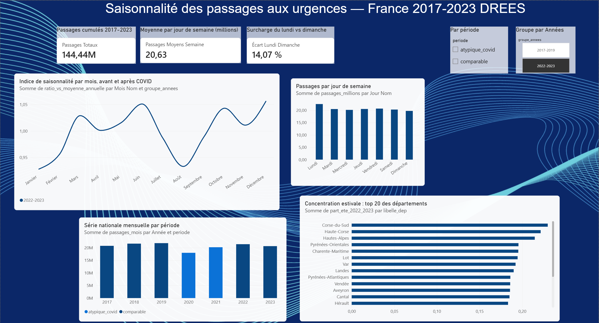

# Saisonnalité des passages aux urgences en France — Dashboard Power BI

  

Pipeline complet d'analyse : requêtes SQL sur Google BigQuery, fiabilisation dans Power Query, dashboard interactif dans Power BI Desktop. Données nationales DREES 2017-2023.

## Contexte

Les services d'urgences enregistrent 16,1 millions de passages en France en 2024 (Drees, *Études et Résultats* n°1334, mars 2025), et la moitié des patients a attendu plus de trois heures en 2023. Pour un planificateur hospitalier, dimensionner les ressources — personnel, lits, organisations de garde — suppose de connaître la forme réelle du cycle annuel de fréquentation. L'intuition commune y voit un simple pic hivernal grippe. Ce projet teste cette intuition sur sept années de données nationales.

## Question de recherche

**La saisonnalité des passages aux urgences est-elle encore un cycle hivernal fiable, ou un cycle plus complexe — double pic hiver + été — dont l'amplitude se renforce après la période COVID ?**

## Hypothèses

1. Le cycle hivernal (grippe) est présent et relativement stable sur la période.
2. Le cycle estival (tourisme dans les départements du sud + épisodes de chaleur) est présent et s'intensifie en fin de période (étés 2022-2023).
3. La période COVID (2020-2021) constitue une rupture structurelle : les cycles pré et post-COVID sont comparés séparément.
4. Effet jour de semaine : le lundi est le jour le plus chargé — résultat publié par la DREES (Khaoua & Suarez Castillo, *Études et Résultats* n°1320, déc. 2024) dont la reproduction sert de validation méthodologique.

## Données

**Source** : DREES (Direction de la recherche, des études, de l'évaluation et des statistiques) — passages quotidiens aux urgences par département, janvier 2017 à décembre 2023, France entière (métropole + DROM). Une vue `v_passages` prépare les données dans BigQuery : codage du jour de semaine (0 = lundi), périodes (`comparable` / `atypique_covid` pour 2020-2021), groupes d'années (`2017-2019` / `2022-2023`).

**Six tables agrégées** produites par les requêtes SQL:

| Fichier | Contenu | Grain |
|---|---|---|
| `SerieNationale.csv` | Passages par mois, avec période et groupe | 84 mois |
| `RatioMensuel.csv`| Indice de saisonnalité mensuel par groupe (1 = moyenne annuelle) | 24 lignes |
| `CycleMensuel.csv` | Moyenne par jour de chaque mois, par groupe — table de contrôle | 24 lignes |
| `JourSemaine.csv` | Passages cumulés par jour de semaine (effet lundi) | 7 lignes |
| `DepJourSemaine.csv` | Passages par département × jour de semaine | ~700 lignes |
| `Top20Ete.csv`| Top 20 des départements : part de l'été (juillet-août) dans les passages annuels, avant/après COVID | 20 lignes |

## Méthode — pipeline en trois étages

| Étage | Outil | Rôle |
|---|---|---|
| 1. Agrégation | SQL BigQuery | 6 requêtes analytiques (CTE, fonctions de fenêtre, agrégation conditionnelle) — voir `requetes_bigquery-sql-prêt-à-publier-sur-github.py` |
| 2. Fiabilisation | Power Query | Typage des colonnes, gestion des séparateurs décimaux régionaux, libellés de calendrier, tris |
| 3. Restitution | Power BI Desktop | Mesures DAX, visuels interactifs, segments |

Principaux choix de calcul : les moyennes mensuelles sont calculées **par jour** (neutralisation de la longueur inégale des mois) ; l'indice de saisonnalité divise chaque mois par la moyenne annuelle de son groupe via `AVG() OVER (PARTITION BY groupe_annees)` ; la concentration estivale utilise une agrégation conditionnelle `SUM(IF(mois IN (7,8), ...))` ; la période COVID est exclue des comparaisons structurelles.

Mesures DAX principales : `Passages Totaux`, `Passages Moyens Semaine`, `Écart Lundi Dimanche`, plus deux colonnes de libellés (`Jour Nom`, `Mois Nom`) avec tri explicite par numéro — les libellés seuls s'affichent toujours dans l'ordre du calendrier.

## Les résultats

- **La saisonnalité n'est pas un pic hivernal unique : c'est un double pic juin-décembre avec creux d'août.** En 2017-2019 : juin à 1,043 et décembre à 1,014 (indice vs moyenne annuelle), août à 0,959.
- **L'amplitude saisonnière s'est renforcée après COVID : +52 %** — de 8,4 points (2017-2019) à 12,8 points (2022-2023). Le contraste annuel s'est creusé : février 2022-2023 descend à 0,928 quand décembre monte à 1,056.
- **L'effet lundi est confirmé : +14 %** — 22,5 M de passages cumulés le lundi contre 19,7 M le dimanche, cohérent avec l'étude publiée de la DREES, ce qui valide la méthode du projet.
- **La concentration estivale des départements touristiques a légèrement reculé** : Haute-Corse -2,1 pts, Vendée -1,8 pt, Var -1,6 pt ; seules les Hautes-Alpes progressent (+0,6 pt). L'hypothèse 2 (intensification du versant estival) est **infirmée** sur 2017-2023 : le renforcement porte sur le contraste annuel global, pas sur le tourisme d'été.

[Indice_2017-2019](indice_saisonnalité_2017_2019.png)

## Le dashboard

 (1 page, 4 visuels + 3 KPI + 2 segments)

- **Visuel pilote** : indice de saisonnalité par mois, deux lignes (2017-2019 vs 2022-2023), ligne de référence à 1 (moyenne annuelle), axe ajusté 0,9-1,1 — l'écrasement d'axe à partir de 0 y rendrait le signal illisible.
- **Effet jour de semaine** : histogramme des 7 jours, étiquettes de données affichées (axe conservé à zéro pour ne pas exagérer visuellement un écart de 14 %).
- **Série nationale mensuelle** : courbe 2017-2023, légende par période — la rupture COVID se lit directement.
- **Top 20 estival** : barres horizontales par département, part 2022-2023.
- **Cartes KPI** : passages cumulés, moyenne par jour de semaine, surcharge du lundi.
- **Segments** : période et groupe d'années.

[Indice_2022-2023](Indice_saisonnalité_2022_2023.png)

## Contrôle qualité des données

Trois incidents de format rencontrés et corrigés lors du pipeline — documentés parce que représentatifs des enjeux réels de fiabilisation :

1. **Arrondi silencieux** : un typage en nombre entier transformait l'indice de saisonnalité (0,93-1,06) en « 1 partout », sans message d'erreur. Leçon : vérifier les valeurs après chaque changement de type, jamais se fier au silence de l'outil.
2. **Séparateur décimal régional** : conversions texte→décimal en échec jusqu'à l'alignement de la locale de conversion sur le séparateur réellement présent dans les cellules (point → locale anglaise ; virgule → locale française).
3. **Comparaison Texte/Entier** : une colonne de mois retypée en texte cassait une mesure DAX SWITCH — corrigé par re-typage à la source plutôt que par contournement dans la formule.

## Limites

**Les données s'arrêtent en 2023 ; l'aggravation climatique documentée par Santé publique France en 2025-2026 (plus de 24 000 passages liés à l'indicateur iCanicule en été 2025, pics de chaleur de plus en plus précoces dès mai) suggère que la composante estivale mesurée ici est vraisemblablement une borne basse de la réalité actuelle.** Les résultats 2022-2023 constituent un plancher, pas une photographie du présent. Autres limites : l'annualisation de l'indice approche la moyenne annuelle par la moyenne des 12 moyennes mensuelles ; la sélection du top 20 porte sur la concentration 2022-2023 ; les passages ne sont pas distingués par motif (l'été médical — déshydratation, noyades — reste indissociable de l'été touristique dans ces données).

## Reproduire et explorer

1. Ouvrir `dashboard_urgences_drees_2017_2023.pbix` avec Power BI Desktop (gratuit) : le modèle et les mesures se rechargent automatiquement.
2. Sans Power BI : les 6 CSV du dossier se lisent directement.
3. Les requêtes du [SQL](requetes_bigquery-sql-prêt-à-publier-sur-github.py) sont réexécutables dans BigQuery sur les données publiques DREES (identifiant de projet neutralisé dans le fichier publié).

## Compétences mobilisées

SQL analytique BigQuery (CTE, fonctions de fenêtre, agrégation conditionnelle) · modélisation Power BI et mesures DAX · Power Query (typage, paramètres régionaux) · design de dashboard (indices, lignes de référence, échelles honnêtes) · documentation de méthodologie et d'hypothèses · contrôle qualité des données.

## Licence

Code et requêtes sous licence MIT. Les données restent la propriété de la DREES (données publiques, source citée) ; ce projet en cite systématiquement l'origine.

## Sources

- DREES — passages aux urgences 2017-2023 (data.drees)
- Khaoua & Suarez Castillo, « En un an, la fréquentation des urgences augmente... », *Études et Résultats* n°1320, Drees, déc. 2024
- Drees, *Études et Résultats* n°1334, mars 2025
- Santé publique France — bulletins iCanicule, étés 2025 et 2026

## Auteur

**Stephanie Le Levier** — Analyste data, certifiée Google Data Analytics. [LinkedIn](https://www.linkedin.com/in/stephanie-le-levier/)

